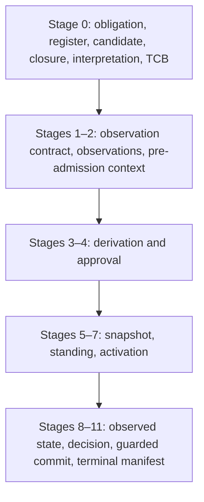

# Canonical interface floor

This document records the interface floor implemented by the v0.6 reference harness. The Python dataclasses are the executable schema; this file explains their relations and claim ceilings.

## Proof construction order

Every immutable node carries an ID, type, schema version, creation time, stage, payload digest and `depends_on` list. The verifier rejects duplicate IDs, missing dependencies, self-reference, forward reference and cycles. The terminal manifest commits the ordered graph but is never an input to a node.

## Admission versus operation

| Layer | Types | What it establishes |
|---|---|---|
| Admission | `ALLOW`, `HOLD`, `DENY` | Whether current standing is established relative to the bound decision state |
| Operation | `NOT_ATTEMPTED`, `COMMITTED`, `TRANSACTION_CONFLICT`, `TRANSACTION_FAILURE`, `INTEGRITY_FAILURE`, `STATE_INDETERMINATE`, `COMMIT_PRECONDITION_CONFLICT`, `HALTED` | What happened when the harness tried to activate or commit |

An operational failure never rewrites an admission verdict. A candidate may be admissible while its attempted activation fails integrity checks.

## Observation contract

An `ExternalObservation` cannot declare its own evidentiary jurisdiction. It binds an independently signed `ObservationContract` that specifies:

- source identity, role and endpoint;
- namespace, object coverage and exclusions;
- permitted predicates and negative-evidence semantics;
- temporal policy, freshness limit and interpretation rule;
- the register-relative authority proof for the contract issuer.

`ABSENCE_OBSERVED` does not become a negative fact unless the contract expressly warrants that inference for the exact source, namespace, object and freshness relation.

## Checked-to-executed binding

`InterpretationBinding` covers:

1. source bytes;
2. canonicaliser identity and canonical form;
3. parser identity and parsed IR;
4. loader identity, includes, ordering and defaults;
5. behavior-affecting environment inputs;
6. normalized executable form;
7. engine instance and loaded closure read-back.

Identity across this chain does not prove substantive correctness. It prevents representation A from standing in for executed interpretation B.

## Standing and revalidation

`StandingRecord` binds the exact `AdmissionSnapshot`, evaluation time, `revalidate_by`, temporal policy and every observation freshness basis. It cannot be reused after that horizon. Every governed consequence requires a Standing evaluation valid at the declared commit boundary.

Candidate refusal gives no result for the incumbent. The incumbent or declared fallback must independently establish current standing; otherwise the harness returns no-policy `HOLD` or `DENY` as appropriate.

## Activation

Activation is single-writer and compare-and-swap guarded by:

- engine and state namespace;
- policy slot ID;
- expected slot version;
- transaction ID;
- exact `ACTIVATE_POLICY` principal, grant, scope and register version;
- bound `ALLOW` Standing record.

At most one overlapping request may commit. A loser receives `TRANSACTION_CONFLICT`. If read-back cannot establish either the clean before-state or intended after-state, the engine becomes `QUARANTINED`; failure does not imply rollback.

## Guarded consequential commit

The governed boundary is the exact local adapter operation where the declared effect becomes externally effective. A diagnostic, preview, dry run or cached decision carries `NO_AUTHORITY_TO_COMMIT`.

The final guard binds snapshot, standing, observations, authority state, target and scope, engine instance, namespace, slot version, closure, engine-state version, action and payload. The guard compares the expected versioned state and performs the effect only while it still matches. Any change produces `COMMIT_PRECONDITION_CONFLICT`, zero consequences and a requirement for fresh standing.

## Proof ceiling

The harness may prove only what its declared inputs and local state support. It never emits `SAFE`; does not prove the legitimacy of the trust root; does not prove that a derivation is substantively warranted; and does not generalize its enumerated surface into global non-bypassability.
